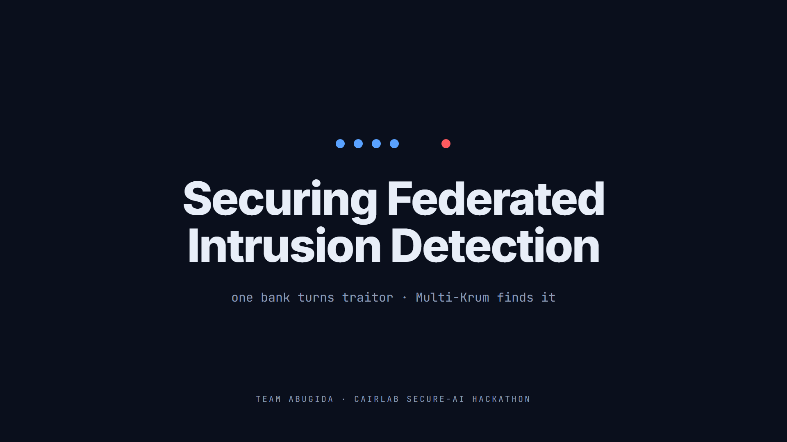
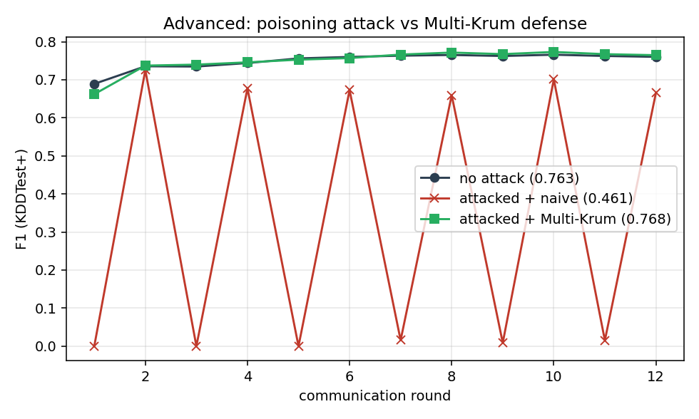
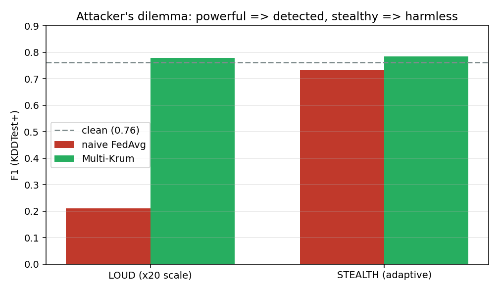

# Securing Federated Intrusion Detection

**CAIRLab Secure-AI Hackathon, Days 2–3 · Team Abugida** · Tracks: 🔴 Advanced (primary) + 🟡 Intermediate



Five simulated banks train one shared NSL-KDD intrusion detector with federated learning, without pooling their data. We harden naive FedAvg against two failure modes: a **malicious bank** that poisons its updates (Advanced track, our primary submission), and **non-IID** client data (Intermediate track).

## Results

F1 on the held-out KDDTest+ set at the standard 0.5 threshold, mean over 3 seeds. Each comparison keeps the model, split and number of rounds fixed.

| Track | Setting | Naive FedAvg | Our method | Δ F1 |
|---|---|---|---|---|
| 🔴 **Advanced (primary)** | largest bank (client 2, ~43% of data) poisoned: label-flip + update ×20 | **0.211** | **Multi-Krum 0.780** | **+0.569** |
| 🟡 Intermediate | non-IID split (Dirichlet α = 0.3 by attack family) | 0.729 | **SCAFFOLD + class-balanced loss 0.797** | **+0.068** |

- **Traitor detection:** Multi-Krum flags the malicious bank with precision = recall = 1.0.
- **Attack strength doesn't matter:** Multi-Krum holds ≈ 0.78 from ×10 to ×100, while naive FedAvg thrashes.
- **The attacker's dilemma:** an adaptive attacker that caps its update to evade size-based filters blinds a norm-based detector (recall 0.0). But the capped attack is too weak to matter: naive FedAvg only drops from 0.76 to 0.73. Multi-Krum lands at ≈ 0.78 either way.
- **Two traitors** (clients 2 and 4, beyond Krum's formal n = 5 guarantee): coordinate median recovers to 0.813, and Multi-Krum (f = 2) to 0.794 with detection recall 1.0.
- **Exported model:** 0.783 F1 at 0.5 (the honest headline), and 0.906 with the calibrated threshold baked in (see the writeup's calibration note).

<p>
  
  
</p>

## Repository

| File | Contents |
|---|---|
| [`securing_federated_ids.ipynb`](securing_federated_ids.ipynb) | Full solution, executed top-to-bottom with outputs |
| [`model_scripted.pt`](model_scripted.pt) | Exported TorchScript model: Multi-Krum-defended MLP, 41-feature input |
| [`submission.json`](submission.json) | Team, track and every reported metric |
| [`WRITEUP.md`](WRITEUP.md) | The report (also submitted as the Kaggle Writeup) |
| [`media/`](media/) | Cover image and all figures, regenerated by the notebook |

## Reproduce

Python 3.10+, CPU only, under 10 minutes. The notebook downloads NSL-KDD itself.

```bash
pip install -r requirements.txt jupyter
jupyter nbconvert --to notebook --execute securing_federated_ids.ipynb --output rerun.ipynb
```

The run rebuilds the seed-locked non-IID split and runs every before/after comparison over 3 seeds. It then regenerates `media/` and rewrites `model_scripted.pt` and `submission.json`.

To check the exported model, load it and score KDDTest+ preprocessed as in Section 1 of the notebook:

```python
import torch
m = torch.jit.load("model_scripted.pt").eval()
preds = (torch.sigmoid(m(X_test)) > 0.5).int()   # X_test: 41 standardized features
# F1(preds, y_test) == submission.json["self_reported_metrics"]["f1"]
```

## Method

**Intermediate.** Non-IID data hurts in two ways, so we fix both. SCAFFOLD control variates cancel client *drift*, and a class-balanced local loss neutralizes *label* skew. Together they overshoot the IID reference.

**Advanced.** Multi-Krum keeps the *n − f* most mutually consistent client updates by geometric distance and discards the outliers. Because selection ignores magnitude, scaling up an attack backfires, and the discarded index is a perfect traitor detector. We stress-test it with an adaptive, norm-mimicking attacker, where the attacker cannot win either way, and with two simultaneous traitors, where the system degrades gracefully.

## License

[MIT](LICENSE)
